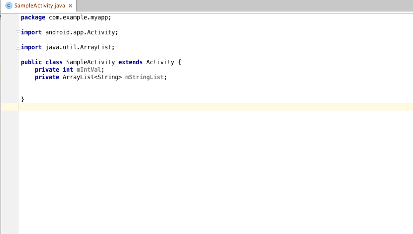

# CreateIntentGenerator

This plugin generates a createIntent method into Android Activity.

## Installation

0. Open Android Studio
0. `Preferences` -> `Plugins` -> `Browse Repositories`, then search `CreateIntentGenerator` and Install

## Usage



0. Right click on activity code, then `Generate` and `createIntent`
0. Select field to put into intent
 
## License

```
Copyright (C) 2015 Seesaa Inc.
Copyright (C) 2015 Michał Charmas (http://blog.charmas.pl)
Copyright (C) 2015 Dallas Gutauckis (http://dallasgutauckis.com)

Licensed under the Apache License, Version 2.0 (the "License");
you may not use this file except in compliance with the License.
You may obtain a copy of the License at

     http://www.apache.org/licenses/LICENSE-2.0      

Unless required by applicable law or agreed to in writing, software
distributed under the License is distributed on an "AS IS" BASIS,
WITHOUT WARRANTIES OR CONDITIONS OF ANY KIND, either express or implied.
See the License for the specific language governing permissions and
limitations under the License.
```